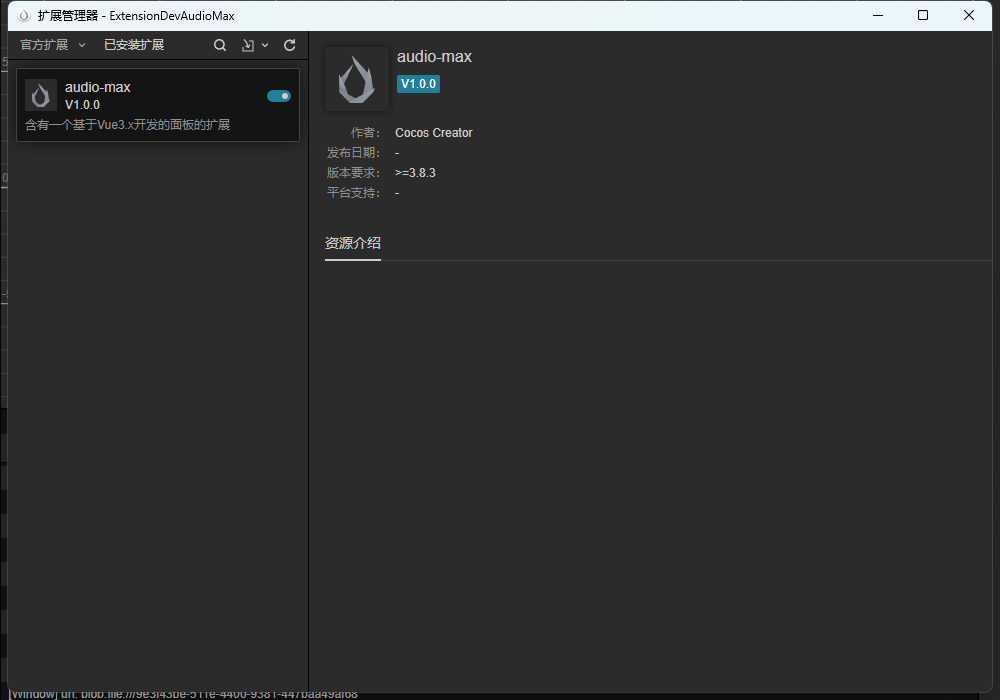
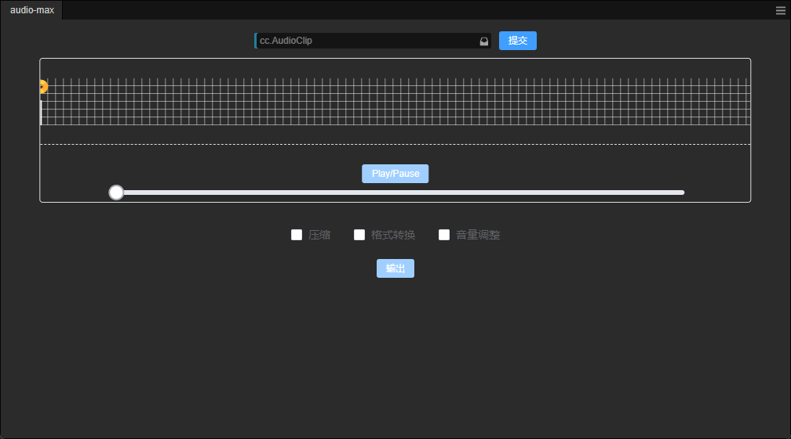
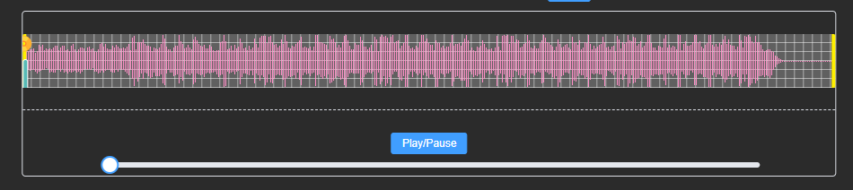
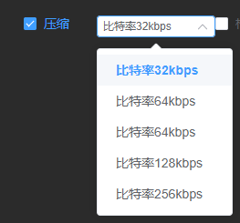
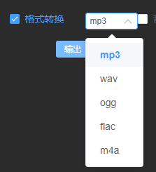
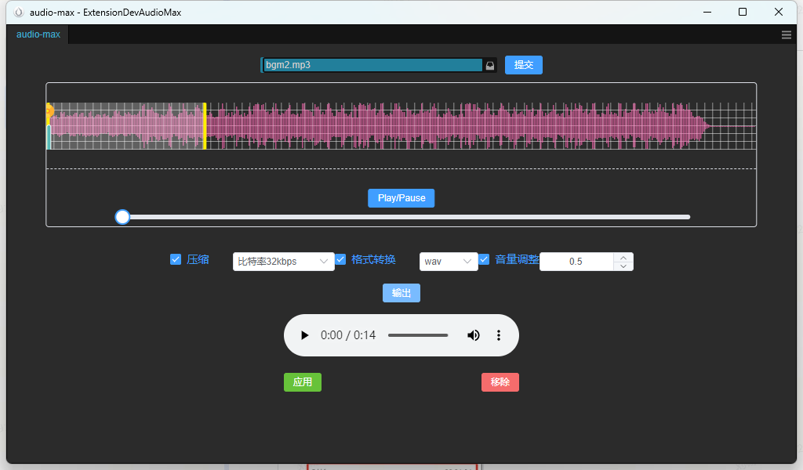
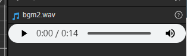

# AudioMax

## 功能介绍

### 简介

AudioMax 是一个基于 CocosCreator 插件系统开发的音频处理工具，它提供了一系列的音频处理功能，包括音频截取、音频播放、音频压缩、音频音量调节、音频格式转换等。此外, AudioMax 的主要功能实现由以下开源库提供支持：

- [flunt-ffmpeg](https://github.com/fluent-ffmpeg)
- [wavesurfer.js](https://github.com/katspaugh/wavesurfer.js)

### 安装注意事项

- AudioMax 目前实测支持 3.8.3，其它版本自测。
- 使用本插件前请先安装[ffmpeg](https://github.com/BtbN/FFmpeg-Builds/releases)，并且设置好环境变量了再使用。
- 目前仅在 windows os 上测试通过，mac os 未测试。

## 使用教程

### 1.进入插件目录，运行`npm install`和`npm install @types` 命令安装插件依赖库。

### 2.在 cocos 引擎扩展面板中导入并启用本插件。

### 3.在扩展菜单中打开 AudioMax 面板。

### 4.选择一个音频生成波形图，下面有播放暂停按钮和波形图缩放按钮。可以调整起始位置和结束位置来截取音频。

### 5.压缩音频，基于降低比特率压缩。

### 6.格式转换。

### 7.音量调整，基于源音频调节，最小值 0.1，最大值 10。

### 8.点击输出，可以预览调节后的音频。

### 9.点击应用，修改后的音频将自动存储到原音频目录中，如果没有格式转换的话，音频会覆盖原音频。

## 联系作者：

- 邮箱: stk.bossliu@gmail.com

## 开源地址:

- 如果觉得有用，请给个 star 哦，谢谢！
- https://github.com/Stk-BossLiu/AudioToolsForCocosCreator
